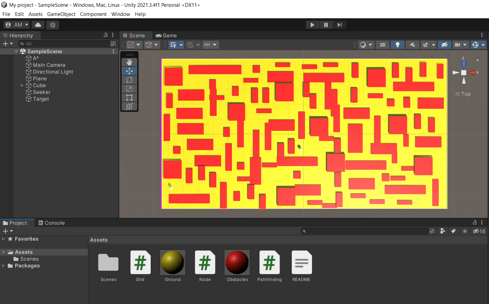
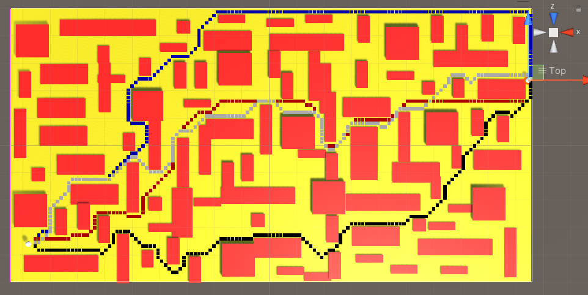

# Unity-Path-Finding-Search-Algorithm

Me and my teamate have improved the code of @SebLague algorithm for finding the shortest path between a target and a start point in Unity. We have added new algorithms to the code such as A-Star-Search-Algorithm using the Manhattan and Euclidean distances , Depth-First-Search-Algorithm, Breadth-First-Search-Algorithm, and Uniformed Cost-Search-Algorithm.

```
White -> A* Euclidian Search
Red -> A* Manhattan Search
Green -> Breadth First Search
Blue -> Depth First Search
Black -> Uniform Cost Search
```






