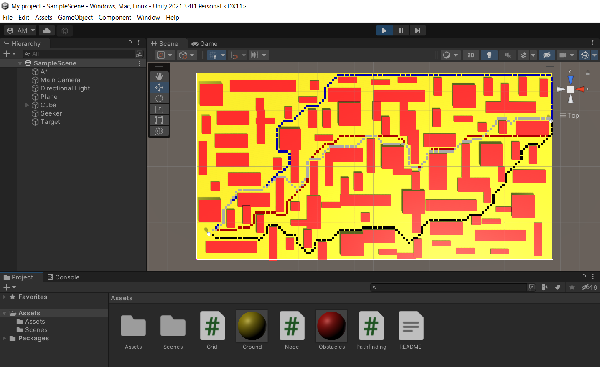
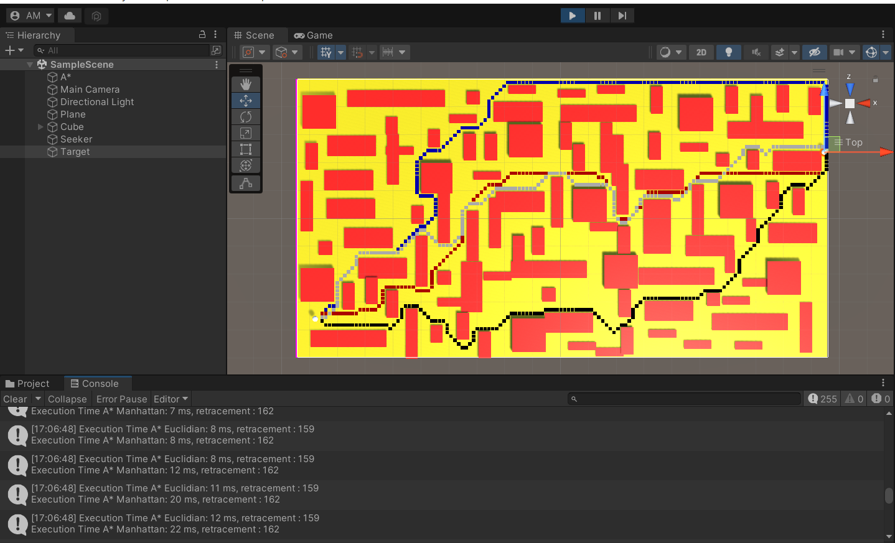

# Unity-Path-Finding-Search-Algorithms

Me and my teamate `Hamza Ammad` have improved the code of @SebLague algorithm for finding the shortest path between a target and a start node in the Unity game engine. We have upgraded and added new algorithms to the code such as A-Star-Search-Algorithm using the Manhattan and Euclidean distances , Depth-First-Search-Algorithm, Breadth-First-Search-Algorithm, and Uniformed Cost-Search-Algorithm.

Check out @SebLague's on [YouTube](https://www.youtube.com/watch?v=-L-WgKMFuhE&list=PLFt_AvWsXl0cq5Umv3pMC9SPnKjfp9eGW) and [GitHub](https://github.com/SebLague/Pathfinding).

```
White -> A* Euclidian Search
Red -> A* Manhattan Search
Green -> Breadth First Search
Blue -> Depth First Search
Black -> Uniform Cost Search
```







